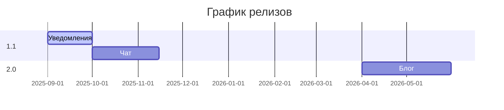

# JobAggregator 🚀

Веб-приложение для агрегации вакансий, соединяющее соискателей и работодателей на одной платформе.

## ✨ Основные возможности

### Для соискателей:
- 🔍 Поиск и фильтрация вакансий по различным критериям
- 📝 Создание и управление профессиональным резюме
- 💾 Сохранение интересных вакансий в избранное
- ✉️ Прямой отклик на вакансии

### Для работодателей:
- 🏢 Создание профиля компании
- 📢 Публикация и управление вакансиями
- 👀 Поиск кандидатов по базе резюме
- 💌 Отправка персональных предложений кандидатам

## 🛠 Технологический стек

### Backend (Web API)
| Технология | Описание |
|------------|----------|
|  | Основной фреймворк |
|  | ORM для работы с БД |
|  | Система управления базами данных |
|  | Документация API |
|  | Аутентификация |

### Frontend
| Технология | Описание |
|------------|----------|
|  | Основной фреймворк |
|  | UI компоненты |
|  | Среда выполнения |

## 🚀 Установка и запуск

### Предварительные требования
- [.NET 9.0+](https://dotnet.microsoft.com/download)
- [Node.js 22.x](https://nodejs.org/)
- [PostgreSQL 16+](https://www.postgresql.org/download/)

### Backend
```bash
# Клонирование репозитория
git clone https://github.com/raketos2013/JobAggregator
cd JobAggregator

# Восстановление зависимостей
dotnet restore

# Настройка базы данных (укажите свои параметры в appsettings.json)
dotnet ef database update

# Запуск приложения
dotnet run
```


## 🖥 Frontend

### Основные технологии:
-  [Angular 20.0+](https://angular.io/) - Основной фреймворк
-  [Angular Material](https://material.angular.io/) - UI компоненты
-  [Node.js 22+](https://nodejs.org/) - Среда выполнения

## 🗺 Roadmap

### ✅ Версия 1.0 (Текущая)
- [x] Базовый функционал вакансий и резюме
- [x] Поиск и фильтрация
- [x] Авторизация и ролевой доступ
- [x] Базовые уведомления

### 🔄 Версия 1.1 (Q4 2025)
- [ ] Полноценная система уведомлений (email + web push)
- [ ] Чат между пользователями
- [ ] Аналитика просмотров

### 🚀 Версия 2.0 (Q2 2026)
- [ ] Блог-платформа
- [ ] Система рекомендаций
- [ ] Мобильное приложение

#### Прогресс разработки:


## 📬 Контакты

### 📩 Связь с разработчиком
- **Email**: [daniilgol123498@gmail.com](mailto:daniilgol123498@gmail.com)
- **LinkedIn**: [Daniil Golubovich](https://www.linkedin.com/in/daniil-golubovich-708641359/)
